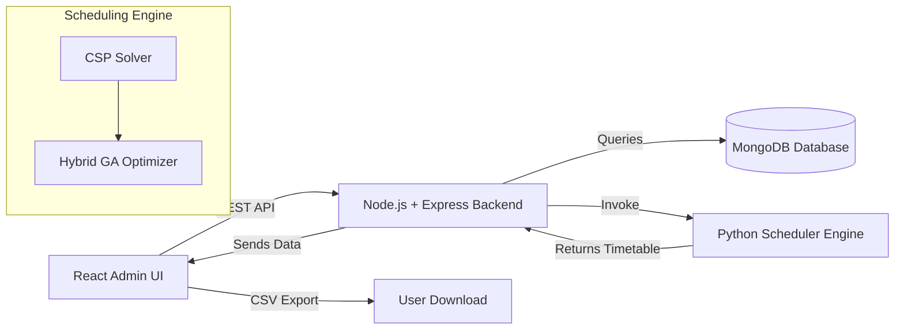

# 🎓 Smart Exam Scheduler


A full-stack university exam scheduling platform that generates conflict-free exam timetables using intelligent algorithms (CSP + Hybrid GA).  
Built with a modern React admin interface, a scalable Node.js backend, and a Python scheduling engine.

<p align="center">
  
  
  
  
  
  
  
  
</p>

---


---

## 🚀 Features

### 💼 Admin Portal
- JWT-based authentication  
- Manage Students  
- Manage Subjects  
- Manage Teachers  
- Manage Halls  

### 🤖 Smart Scheduling Engine
- **CSP Mode**  
  - Fast baseline solver  
  - Ensures no student exam clashes  
  - Assigns halls based on capacity  
- **Hybrid GA Mode**  
  - Genetic Algorithm orders subjects  
  - CSP places them smartly in the timetable  
  - Produces optimized, balanced schedules  

### 📊 Dashboard
- System statistics  
- Quick metrics  
- Recent exam schedule preview  
- CSV export for schedules  

---

## 🧠 Tech Stack

### Frontend
- React  
- React Router  
- Tailwind CSS  
- Axios  

### Backend
- Node.js  
- Express.js  
- MongoDB (Mongoose)  
- JWT Authentication  

### Scheduler
- Python  
- CSP Solver  
- Hybrid GA Optimization  

---

## 🗂 Folder Structure

```
smart-exam-scheduler/
│
├── backend/        # Node.js + Express API
│   ├── src/
│   ├── server.js
│   └── config.env.example
│
├── frontend/       # React Admin UI
│   ├── src/
│   ├── App.jsx
│   └── .env.example
│
└── scheduler/      # Python CSP/GA Engine
```

---

## 🔧 Local Development Setup

### 1. Backend Setup
```
cp backend/config.env.example backend/config.env
npm --prefix backend install
npm --prefix backend run start
```

### 2. Frontend Setup
```
cp frontend/.env.example frontend/.env
npm --prefix frontend install
npm --prefix frontend run start
```

### Running URLs
- Frontend: http://localhost:3000  
- Backend:  http://localhost:5000  

---

## 🔐 First Login

1. Navigate to:  
   **http://localhost:3000/login**
2. Create the **initial admin account**  
3. Use the same credentials for future logins  

---

## 📅 How Scheduling Works

### Inputs:
- Students  
- Subjects  
- Halls  
- Teacher list  

### Outputs:
- Clean, conflict-free exam timetable  
- Optimized slot assignment  
- CSV export  

### Algorithm Pipeline:



---

## 📦 Deployment

Docker and production configuration:  
```
docs/DEPLOYMENT.md
```

Supports:
- Docker Compose  
- Cloud deployment  
- Nginx reverse proxy  
- Railway / Render / VPS  

---

## 👨‍💻 Author

**Macharla Naga Manoj Reddy**  
Smart Exam Scheduler — Prototype Release  

If you found this project helpful, please ⭐ the repo!
