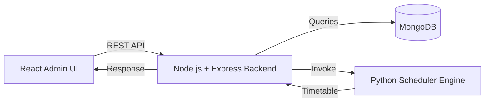

# 🎓 Smart Exam Scheduler


A full-stack university exam scheduling platform that generates conflict-free exam timetables using CSP + Hybrid GA.

<p align="center">
  
  
  
  
  
  
  
  
</p>

---

## 🚀 Features

- JWT-based admin authentication
- Student/subject/teacher/hall management
- Scheduling engine modes:
  - `csp` (fast baseline)
  - `hybrid-ga` (GA-optimized ordering + CSP placement)
- Live dashboard/pages with auto-sync polling
- Blue-outline UI theme with hover/focus effects
- CSV export for generated schedules

---

## 🧠 Tech Stack

- Frontend: React, React Router, Tailwind CSS, Axios
- Backend: Node.js, Express.js, MongoDB (Mongoose), JWT
- Scheduler: Python (CSP + Hybrid GA)

---

## ⚡ Local Development

### One-command startup (recommended)

```bash
chmod +x run.sh
./run.sh
```

`run.sh` will:
- install missing dependencies
- create `backend/config.env` and `frontend/.env` if missing
- auto-pick free ports:
  - backend: `5000-5010`
  - frontend: `3000-3010`
- print exact frontend/backend URLs
- work on macOS Bash 3.2 (`wait -n` not required)

### Manual backend setup

```bash
cp backend/config.env.example backend/config.env
npm --prefix backend install
npm --prefix backend run start
```

### Manual frontend setup

```bash
cp frontend/.env.example frontend/.env
npm --prefix frontend install
npm --prefix frontend run dev
```

---

## 🔐 First Login

- Open the frontend URL shown by `run.sh` (or `http://localhost:3000` if free)
- Click `Login` in the top-right
- If no admin exists yet:
  - check setup status: `GET /api/auth/bootstrap`
  - create first admin: `POST /api/auth/register`

---

## 🗂 Folder Structure

```text
smart-exam-scheduler/
├── backend/         # Express API
├── frontend/        # React admin UI
├── algorithm/       # Python scheduler logic (CSP/GA)
├── docs/            # Deployment and docs
├── scripts/         # Utility scripts
└── run.sh           # Local one-command runner
```

---

## 📅 Scheduling Pipeline



---

## 🛠 Troubleshooting

- `EADDRINUSE` port error:
  - run `./run.sh` (auto-selects free ports), or
  - stop process manually, e.g. `lsof -ti :5000 | xargs kill -9`
- Login shows invalid credentials:
  - clear browser storage (`localStorage`) and retry
  - verify frontend API URL points to the running backend

---

## 📦 Deployment

See deployment notes in:

```text
docs/DEPLOYMENT.md
```

---

## 👨‍💻 Author

**Macharla Naga Manoj Reddy**
