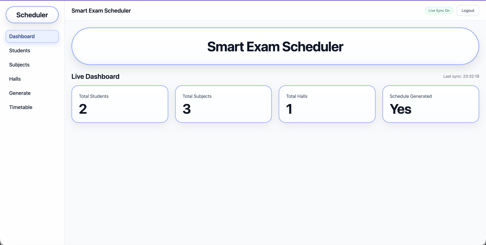
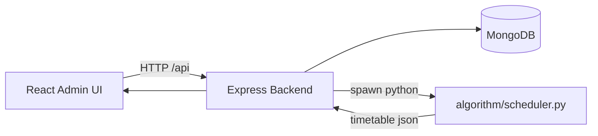

# 🎓 Smart Exam Scheduler


### Latest Dashboard UI


A full-stack platform for generating conflict-free university exam timetables using **CSP** and **Hybrid GA** optimization.

<p align="center">
  
  
  
  
  
  
  
  
</p>

---

## Why This Project

Manual exam timetable creation becomes hard when data grows:
- student subject overlap causes clashes
- hall capacity constraints are easy to miss
- balancing days and slots is time-consuming

Smart Exam Scheduler automates this with a backend-integrated Python scheduler and a live admin UI.

---

## Core Features

- JWT-based admin authentication
- CRUD APIs for Students, Subjects, Halls, Teachers
- Schedule generation from backend using Python engine
- Two scheduling modes:
  - `csp`: fast baseline conflict-free scheduling
  - `hybrid-ga`: genetic ordering + CSP placement
- Live dashboard and tables with auto-sync polling
- Blue-outline UI with hover/focus effects

---

## Tech Stack

- Frontend: React, React Router, Axios, Tailwind CSS, Vite
- Backend: Node.js, Express, Mongoose, JWT
- Database: MongoDB
- Scheduling Engine: Python 3 (`algorithm/scheduler.py`)
- Orchestration: Shell script (`run.sh`) + optional Docker

---

## Architecture



---

## Repository Structure

```text
smart-exam-scheduler/
├── backend/               # Express API + models + routes
├── frontend/              # React admin UI
├── algorithm/             # Python scheduler logic (CSP / Hybrid GA)
├── docs/                  # Deployment and sync docs
├── scripts/               # Utility scripts
└── run.sh                 # One-command local startup
```

---

## Quick Start (Recommended)

### 1. Prerequisites

- Node.js 18+
- npm
- Python 3
- MongoDB running locally (`localhost:27017`) or accessible URI

### 2. Start everything

```bash
chmod +x run.sh
./run.sh
```

`run.sh` behavior:
- installs dependencies if missing
- creates missing env files from examples
- auto-selects free ports
  - backend: `5000-5010`
  - frontend: `3000-3010`
- injects frontend API URL to match selected backend port
- works on macOS Bash 3.2 (no `wait -n` dependency)

When it starts, it prints:
- frontend URL
- backend URL
- API URL

---

## Manual Setup (If You Prefer Separate Terminals)

### Backend

```bash
cp backend/config.env.example backend/config.env
npm --prefix backend install
npm --prefix backend run start
```

### Frontend

```bash
cp frontend/.env.example frontend/.env
npm --prefix frontend install
npm --prefix frontend run dev
```

Important:
- set `VITE_API_URL` in `frontend/.env` to your running backend API base, e.g.:
  - `VITE_API_URL=http://localhost:5000/api`
  - or `http://localhost:5001/api` if 5000 is occupied

---

## Environment Variables

### Backend (`backend/config.env`)

| Variable | Required | Default | Description |
|---|---|---|---|
| `PORT` | No | `5000` | Backend server port |
| `MONGO_URI` | Yes | `mongodb://localhost:27017/exam_scheduler` | Mongo connection string |
| `NODE_ENV` | No | `development` | Node environment |
| `PYTHON_PATH` | No | `python3` | Python executable for scheduler |
| `JWT_SECRET` | Yes | `dev-jwt-secret-change-me` fallback | JWT signing secret |
| `JWT_EXPIRES_IN` | No | `7d` | Token expiry |

### Frontend (`frontend/.env`)

| Variable | Required | Example | Description |
|---|---|---|---|
| `VITE_API_URL` | Yes | `http://localhost:5000/api` | API base URL |

---

## Authentication Flow

All domain routes are protected with JWT middleware:
- `/api/students/*`
- `/api/subjects/*`
- `/api/halls/*`
- `/api/teachers/*`
- `/api/schedule/*`

Auth routes:
- `GET /api/auth/bootstrap` -> check if first admin setup is needed
- `POST /api/auth/register` -> create first admin (only once)
- `POST /api/auth/login` -> login and receive token
- `GET /api/auth/me` -> current user from token

### First login steps

1. Open frontend URL.
2. If no admin exists, call register endpoint once.
3. Login from top-right `Login` button.
4. Token is stored in browser `localStorage` and sent in `Authorization: Bearer <token>`.

### Example cURL

```bash
# Check if admin setup is needed
curl http://localhost:5000/api/auth/bootstrap

# Register first admin (only once)
curl -X POST http://localhost:5000/api/auth/register \
  -H "Content-Type: application/json" \
  -d '{"name":"Admin","email":"admin@example.com","password":"Admin@123"}'

# Login
curl -X POST http://localhost:5000/api/auth/login \
  -H "Content-Type: application/json" \
  -d '{"email":"admin@example.com","password":"Admin@123"}'
```

---

## Scheduling Engine

Schedule generation endpoint:
- `POST /api/schedule/generate`

Request body supports:

```json
{
  "startDate": "2026-05-20",
  "excludeDates": ["2026-05-25"],
  "algorithmMode": "csp",
  "gaPopulation": 30,
  "gaGenerations": 25,
  "gaMutationRate": 0.12
}
```

### Parameters

- `algorithmMode`
  - `csp`: quicker baseline scheduling
  - `hybrid-ga`: better global arrangement at higher compute cost
- `gaPopulation`: population size for GA (used in hybrid mode)
- `gaGenerations`: number of evolution cycles
- `gaMutationRate`: mutation probability (0-1)

### Recommended usage

- Start with `csp` while entering data rapidly.
- Use `hybrid-ga` when finalizing a production timetable.

---

## API Reference (Quick)

### Health

- `GET /health`

### Students

- `GET /api/students`
- `GET /api/students/:id`
- `POST /api/students/add`
- `POST /api/students/bulk`
- `PUT /api/students/:id`
- `DELETE /api/students/:id`

### Subjects

- `GET /api/subjects`
- `GET /api/subjects/:code`
- `POST /api/subjects/add`
- `POST /api/subjects/bulk`
- `PUT /api/subjects/:code`
- `DELETE /api/subjects/:code`

### Halls

- `GET /api/halls`
- `GET /api/halls/:id`
- `POST /api/halls/add`
- `POST /api/halls/bulk`
- `PUT /api/halls/:id`
- `DELETE /api/halls/:id`

### Teachers

- `GET /api/teachers`
- `GET /api/teachers/:id`
- `POST /api/teachers/add`
- `POST /api/teachers/bulk`
- `PUT /api/teachers/:id`
- `DELETE /api/teachers/:id`

### Schedule

- `POST /api/schedule/generate`
- `GET /api/schedule/all`
- `GET /api/schedule/date/:date`
- `GET /api/schedule/department/:dept`
- `GET /api/schedule/semester/:sem`
- `DELETE /api/schedule/clear`
- `GET /api/schedule/stats`

---

## Data Model Summary

- `Student`: `studentId`, `name`, `email`, `department`, `semester`, `subjects[]`
- `Subject`: `code`, `name`, `department`, `semester`, `preferredSlot`, `duration`
- `Hall`: `hallId`, `name`, `capacity`, `building`, `isAvailable`
- `Teacher`: `teacherId`, `name`, `email`, `department`, `isAvailable`
- `Schedule`: generated exam entries with subject, date, slot, hall, semester, department

---

## UI Notes

- Dashboard cards and tables sync automatically on interval polling.
- Timetable page refreshes live student counts based on current student-subject mapping.
- Login modal includes focus outline behavior for keyboard-friendly input flow.

---

## Troubleshooting

### `EADDRINUSE: address already in use`

- Cause: port already occupied by previous process.
- Fix:
  - use `./run.sh` (auto-port fallback), or
  - stop existing process manually:

```bash
lsof -ti :5000 | xargs kill -9
lsof -ti :3000 | xargs kill -9
```

### Login shows `Invalid email or password`

- ensure backend is running and reachable at configured `VITE_API_URL`
- clear browser local storage and retry
- if needed, reset admin password in DB

### Students not reflected in timetable counts

- ensure student `subjects[]` values match subject **code** or **name**
- regenerate schedule after major data changes

### Mongo not connected

- start local MongoDB or update `MONGO_URI` to remote cluster

---

## Deployment and Sync Docs

- Deployment guide: [`docs/DEPLOYMENT.md`](docs/DEPLOYMENT.md)
- GitHub + LinkedIn update workflow: [`docs/GITHUB_LINKEDIN_SYNC.md`](docs/GITHUB_LINKEDIN_SYNC.md)

---

## Author

**Macharla Naga Manoj Reddy**

If this project helped you, consider starring the repository.
